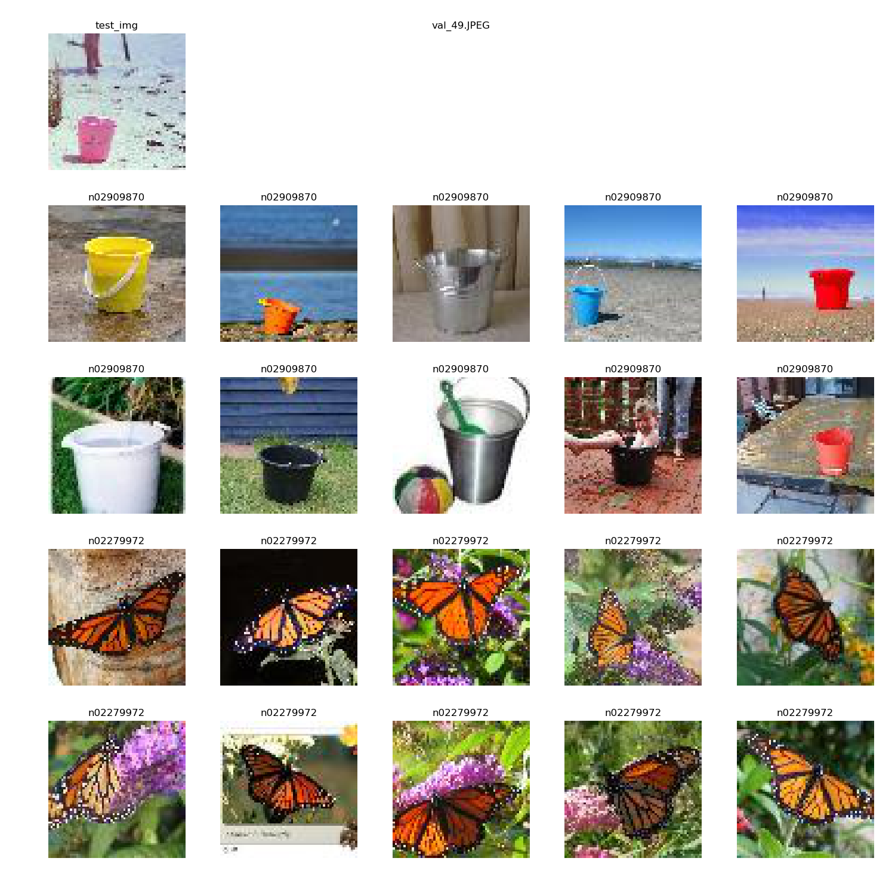

# Image Similarity Ranking using Deep CNN

## Goal: find top n and bottom n images most similar with respect to a query image

## Results Visualization
* Example 1

* Example 2

## Components
* a triplet sampling module
* 3 copies of a deep CNN image encoder to convert images into the corresponding latent vectors
* an image ranking layer; use max margin triplet loss measured in Euclidean distance in latent space
* a visualization module to plot the top 10 and bottom 10 similar images w.r.t. a query image

